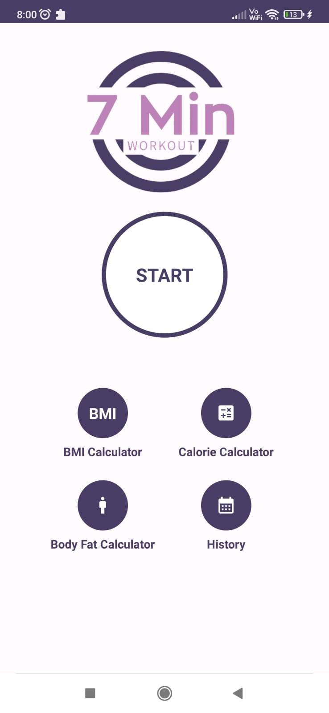
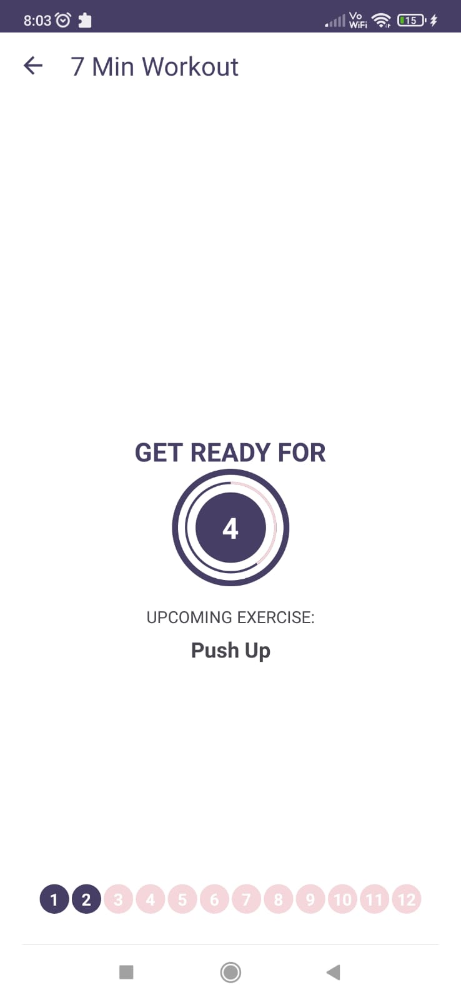
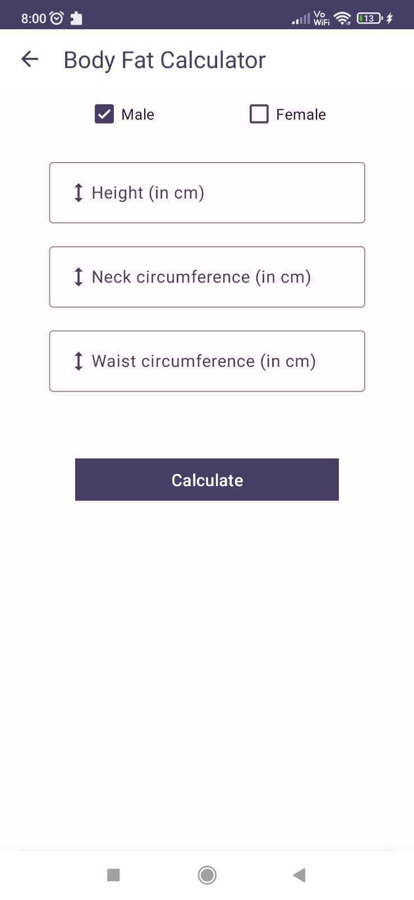
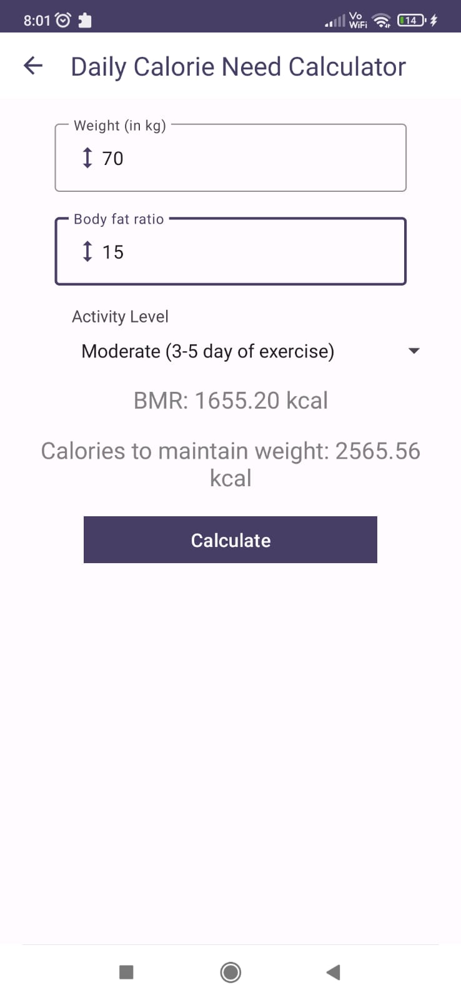

# 7 Min Workout

The 7 Min Workout App is a fitness application designed to provide users with a quick and efficient workout routine. The app guides users through a series of exercises, each lasting for 30 seconds with a 10-second rest period in between. The workout consists of 12 different exercises, targeting various muscle groups and providing a full-body workout.

# Features

  1. Simple and intuitive user interface.
  2. Timer-based workout with exercise and rest periods.
  3. Voice guidance using Text-to-Speech (TTS) to announce exercise names and rest periods.
  4. Progress tracking with exercise status indicators.
  5. History tracking to record completed workout sessions.
  6. Body Mass Index (BMI) calculator and Body Fat Percentage calculator.
  7. Calorie Needs calculator to estimate daily calorie requirements.

# Screenshots

  
  

  
  

# Dependencies

    Text-to-Speech (TTS)
    RecyclerView
    Dialog
    Room Database

# License

This project is licensed under the GNU General Public License (GPL). See the LICENSE file for more information.
